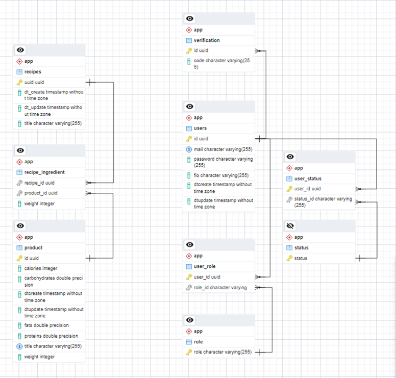
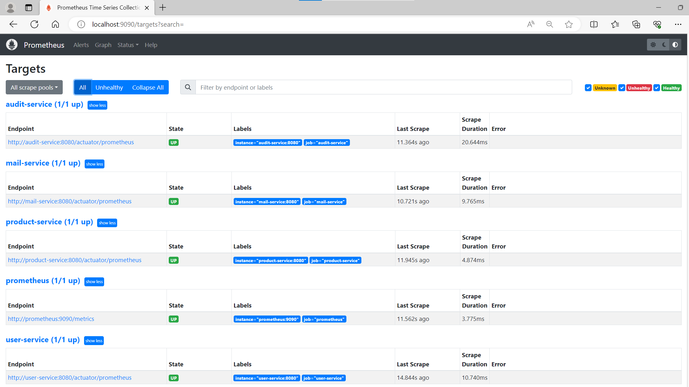
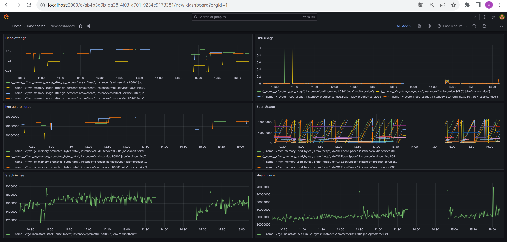
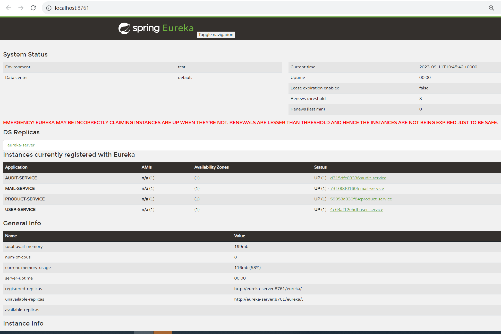

# Healthy Cloud is a microservices-based web application for managing a healthy fitness diet. It is built using the following technologies: Spring Boot, Spring MVC, Spring Data, Spring Security with JWT, Spring Mail, JPA with Hibernate implementation, PostgreSQL, Kafka, Avro, Docker, Swagger UI, Spring Cloud Netflix Eureka, Prometheus, Grafana.
_____________________________________________________ 
 In the Healthy Cloud application, the subject area includes such objects as recipes, ingredients that these recipes consist of, products, users. Figure shows these objects and how they are interconnected.

_____________________________________________________

# Features

User authentication and authorization using JWT tokens

CRUD operations for fitness recipes 

API documentation using Swagger UI

Registration and detection of microservices with Spring Cloud Netflix Eureka

Monitoring using Prometheus, Grafana.

_____________________________________________________

# API Documentation

Upon running the docker-compose, the API documentation is available using Swagger UI. To access it, go to http://localhost:81 in your web browser.  

_____________________________________________________

# Monitoring

Prometheus is available at http://localhost:9090   

Grafana is available at http://localhost:3000 

_____________________________________________________

# Registration and detection of microservices

Spring Cloud Netflix Eureka is available at http://localhost:8761

_____________________________________________________

# Contributing

If you find any issues or bugs in the application, please feel free to report them on the Github Issues page for this project. You can also contribute to the project by submitting a pull request with your changes.
